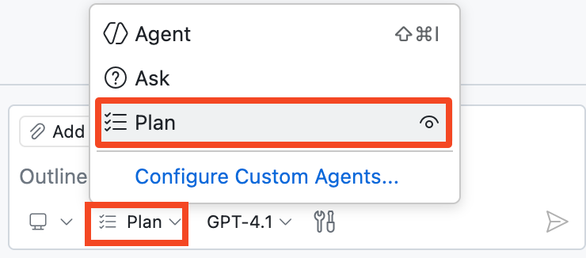

## Passo 4: Planeje sua implementação com o Plan Agent 🧭

No último passo, o Modo Agente nos ajudou a ir rápido e entregar nova funcionalidade. 🚀

Agora vamos desacelerar por uma rodada e trabalhar como arquitetos: definir uma boa abordagem de testes primeiro e então repassar para a implementação. Isso nos dá mais clareza, menos surpresas e resultados mais limpos. 🧪

### 📖 Teoria: O que é o Plan Agent do Copilot?

O [Plan Agent](https://code.visualstudio.com/docs/copilot/agents/planning) do Copilot ajuda você a desenhar uma solução antes que qualquer código seja alterado.

Em vez de pular direto para as edições, ele pesquisa seu pedido, faz perguntas de esclarecimento e elabora um plano de implementação que você pode refinar.

#### Plan Agent (em resumo)

| Aspecto | 🧭 Plan Agent |
| --- | --- |
| Propósito | Cria um plano de implementação estruturado antes de o código começar a ser escrito. |
| Coleta de contexto | Usa pesquisa somente leitura para entender requisitos e restrições. |
| Estilo de colaboração | Faz perguntas de esclarecimento e atualiza o plano com base nas suas respostas. |
| Iteração | Suporta múltiplos passes de refinamento antes da implementação. |
| Segurança | Não edita arquivos até que você aprove o plano e repasse para o **Modo Agente**. |
| Repasse | O botão **Start implementation** entrega o plano aprovado ao **Modo Agente** para escrever o código. |

> [!TIP]
> Você pode começar com um pedido de alto nível e então adicionar restrições e detalhes em prompts subsequentes.

### ⌨️ Atividade: Planejar e implementar testes do backend

Seu backend ainda tem cobertura de testes igual a zero. Use o **Plan Agent** para criar um plano, responder a perguntas e então iniciar a implementação.

1. Abra o painel **Copilot Chat** e alterne para o **Plan Agent**.

   


1. Vamos começar com um prompt amplo e o Copilot nos ajudará a preencher os detalhes:

   > 
   >
   > ```prompt
   > Quero adicionar testes de backend FastAPI em um diretório de tests separado.
   > ```

1. Aguarde o Copilot gerar seu primeiro plano. Se ele fizer alguma pergunta, responda da melhor forma que puder.

   > 🪧 **Nota:** Não se preocupe em deixar perfeito; você sempre pode refinar o plano depois.

1. Você pode refinar o plano e fornecer detalhes adicionais em prompts subsequentes.

   Aqui estão alguns exemplos:

   > 
   >
   > ```prompt
   > Vamos usar o padrão de testes AAA (Arrange-Act-Assert) para estruturar nossos testes
   > ```

   > 
   >
   > ```prompt
   > Garanta que vamos usar `pytest` e adicione-o ao arquivo `requirements.txt`
   > ```


1. Revise o plano proposto e, quando estiver satisfeito com ele, clique em **Start implementation** para repassar ao **Modo Agente**.

   

   Note que ao clicar no botão a interface mudou de **Plan** para **Modo Agente**. A partir daqui, o Copilot pode editar seu codebase, assim como antes.

1. Acompanhe o Copilot implementando o plano que você acabou de criar. Ele pode pedir permissões para executar certas ferramentas (por exemplo, rodar comandos ou criar ambientes virtuais). Aprove essas permissões para que ele possa continuar trabalhando.

1. Revise as alterações e garanta que os testes rodem com sucesso. Se necessário, continue orientando até a implementação estar completa.

   **🎯 Objetivo: ter todos os testes passando (verde) antes de seguir adiante. ✅**

   > 🪧 **Nota:** O Modo Agente pode concluir isso em uma única passada, ou pode precisar de prompts subsequentes seus.

1. **Commit** e **push** de todas as suas alterações para a branch `accelerate-with-copilot`.

1. Aguarde a Mona conferir seu trabalho e compartilhar o próximo passo.

<details>
<summary>Com problemas? 🤷</summary><br/>

- Se os testes não rodarem, peça ao Copilot para executá-los para você.
- Garanta que `pytest` esteja adicionado ao `requirements.txt` e que um diretório `tests/` exista.

</details>
